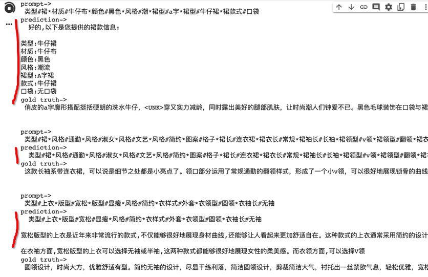
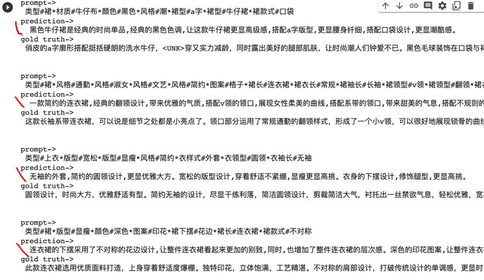

# seven8wen

---

### 中文 LLM (大语言模型) LoRA 微调。colab 免费 GPU 可运行

- [x] ChatGLM-6B
- [x] baichuan-7B
- [x] moss-moon-003-sft T4 和 V100 都跑不动了，可能需要 A100

### Demo

根据提供的若干商品属性，生成一段广告词。 [示例代码](https://github.com/gameofdimension/seven8wen/blob/master/finetune.ipynb) 

#### 微调前输出

#### 微调后效果。样本数量 1500 个，训练了 30 多分钟，虽然用词较单调，但是比微调前还是强多了

### 参考

- https://github.com/mymusise/ChatGLM-Tuning
- https://github.com/THUDM/ChatGLM-6B/blob/main/ptuning/README.md

### 数据集

- [ADGEN](https://drive.google.com/file/d/13_vf0xRTQsyneRKdD1bZIr93vBGOczrk/view?usp=sharing)
- [school math](https://huggingface.co/datasets/BelleGroup/school_math_0.25M)
- [stanford alpaca](https://github.com/tatsu-lab/stanford_alpaca#data-release)